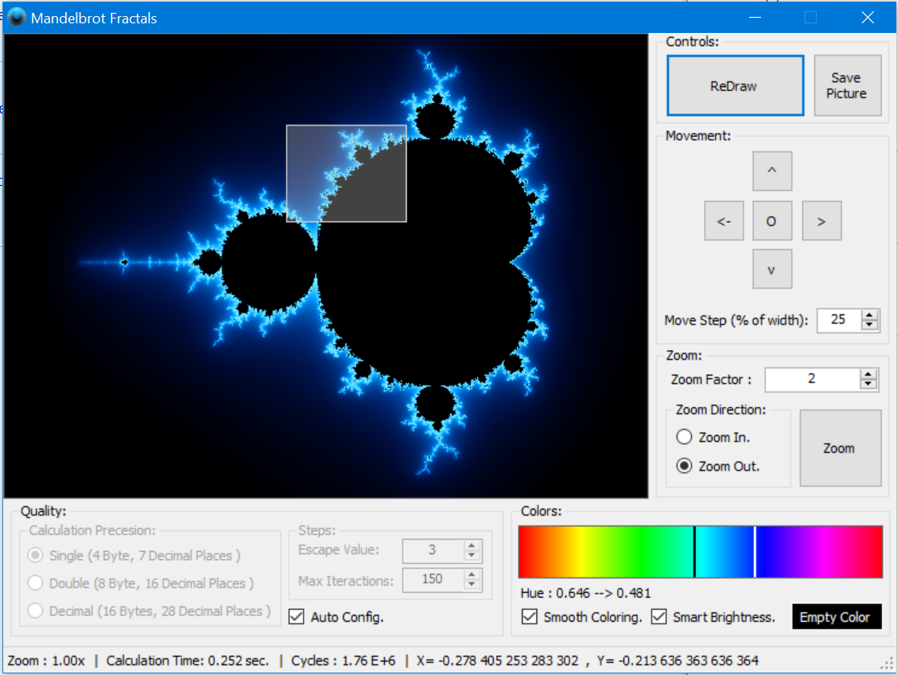

# Mandelbrot Fractals

An old project of mine, to generate beautiful, and zoomable basic fractals.

## Features

* It allows you to build the fractals, navigate, and zoom via mouse selection of specific are, or by keyboard.
* Zooming can be done using different floating-point precision variables, to show how rounding errors will lead to artifacts.
* You can set coloring gradient to your test (use left & right mouse buttons on color plate for that).
* Configure iterations and other things.
* You can save a picture at any point.

## Tools

This project is a WinForms projects, and built using VB.Net and v3.5 Framework.

I used special methods `Marshal.WriteByte` to manipulate and draw the images directly into the memory, for maximum performance.

Also remember to use code optimization (in VS project settings) in the release to get best calculation speed.

## Credits

RGB <-> HSL color space convertor (used for more beautiful gradients) is taken from:
> http://www.bobpowell.net/rgbhsb.htm